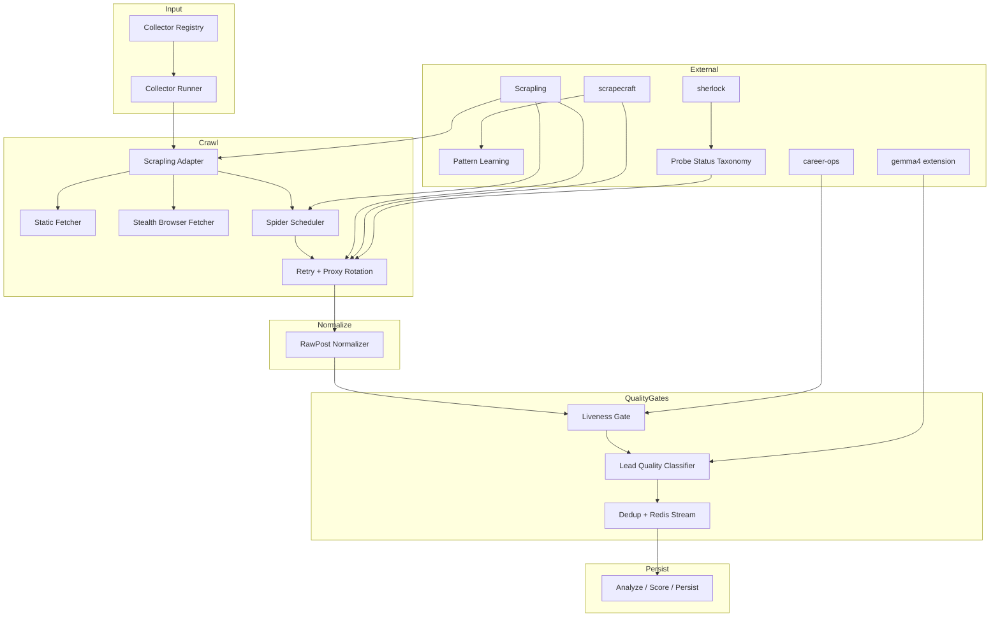

# LeadIQ Crawler Resilience — Execution Plan

## Architecture Overview



## Phases (Typed DAG)

### Phase 1: Crawler Reliability Service
- **Type**: implement + verify
- **File**: `backend/services/crawler_reliability.py`
- **Objective**: Structured retry taxonomy + exponential backoff + scrape result types
- **Pattern source**: scrapecraft retry taxonomy, sherlock probe status
- **Key types**: `ScrapeResult(status, data, error)`, `RetryReason(timeout|rate_limit|blocked|parser_error)`
- **Guardrails**: Must not break existing `RetryHandler` — sits above it as a classification layer
- **Status**: ⏳ PENDING

### Phase 2: Job URL Liveness Gate
- **Type**: implement + verify
- **File**: `backend/services/job_liveness.py`
- **Objective**: Classify job URLs as active/expired/uncertain before they enter pipeline
- **Pattern source**: career-ops/check-liveness.mjs → Python port
- **Key patterns**: expired text, apply-button detection, redirect/error URLs, minimum content threshold
- **Pipeline position**: `collector -> RawPost -> liveness gate -> dedup -> Redis stream`
- **Tests**: `backend/tests/services/test_job_liveness.py`
- **Guardrails**: Must not make network calls — purely heuristic on URL + already-fetched content
- **Status**: ⏳ PENDING

### Phase 3: Lead Quality Classifier
- **Type**: implement + test
- **File**: `backend/services/job_lead_quality.py`
- **Objective**: Deterministic scoring before LLM — role_match, company_signal, application_live, conversion
- **Pattern source**: gemma4-browser-extension (section ranking concept)
- **Scoring**: Chunk text → rank against queries (`web developer hiring`, `react developer`, `agency hiring`)
- **Output fields**: `role_match_score`, `company_signal_score`, `application_live_score`, `conversion_score`, `reason_codes`
- **Tests**: `backend/tests/services/test_job_lead_quality.py`
- **Guardrails**: No LLM calls in this phase — pure deterministic/keyword scoring. Embeddings tracked as future enhancement.
- **Status**: ⏳ PENDING

### Phase 4: Scrapling Adapter
- **Type**: implement + refactor
- **File**: `backend/collectors/scrapling_adapter.py`
- **Objective**: Scheduler (priority queue + URL dedup), CheckpointManager, ProxyRotator, StealthyFetcher
- **Pattern source**: `Scrapling` library patterns
- **Existing asset**: `backend/collectors/scrapling_wrapper.py` — will be refactored into this
- **Guardrails**: Must support existing ScraplingLinkedInCollector API. ProxyRotator must classify proxy failures (timeout vs banned vs CAPTCHA).
- **Status**: ⏳ PENDING

### Phase 5: Refactor Indeed Collector (Proof)
- **Type**: refactor + verify
- **File**: `backend/collectors/indeed.py`
- **Objective**: Wire Indeed through new adapter — fetch mode selection, liveness check, failure telemetry
- **Current problem**: Relies on fragile Playwright `StealthSession` with hardcoded delays; API interception often fails silently; no retry taxonomy
- **Changes**:
  - Use `ScraplingAdapter.get_fetch_mode("indeed")` → determines static vs stealth
  - Pass RawPost through `job_liveness.classify()` after parsing
  - Emit failure telemetry via `crawler_reliability.record_failure()`
- **Tests**: Add parser fixtures for 3-5 sample Indeed HTML pages
- **Status**: ⏳ PENDING

### Phase 6: Pattern Learner
- **Type**: implement
- **File**: `backend/services/source_pattern_learner.py`
- **Objective**: Per-domain success tracking — success rate, selector families, failure reasons, avg extraction time, JS requirement, anti-bot likelihood
- **Pattern source**: scrapecraft/pattern_learner.py
- **Output**: Table backing `fetch_mode` selection — static first for easy sites, stealth for JS/anti-bot, disable for repeated failures
- **Status**: ⏳ PENDING

### Phase 7: Incremental Collector Rollout
- **Type**: refactor
- **Objective**: Port remaining collectors one-by-one through the new architecture
- **Order**:
  1. internshala
  2. shine
  3. naukri
  4. linkedin_jobs
  5. cutshort
  6. hirect
  7. instahyre
  8. timesjobs
  9. weekday
  10. employment_news
- **Each collector**: query generation → fetch mode selection → parser → liveness check → RawPost normalization → failure telemetry
- **Status**: ⏳ PENDING

### Phase 8: Quality Dashboard Metrics
- **Type**: implement + integrate
- **File**: `backend/services/source_metrics.py` (extends existing)
- **Objective**: Track per-source — requests, successful pages, blocked, parser errors, timeout rate, active/expired links, web-dev hits, conversion score avg, posts published
- **Integration**: Feed existing metric collection infrastructure
- **Status**: ⏳ PENDING

### Phase 9: Tests & Verification
- **Type**: test + verify
- **Commands**:
  ```bash
  uv run --project backend pytest backend/tests/collectors -q
  uv run --project backend pytest backend/tests/services/test_job_liveness.py -q
  RUN_LIVE_SCRAPER_TESTS=1 uv run --project backend pytest backend/tests/integration/test_live_job_scrapers.py -q
  ```
- **Coverage**: Parser fixtures (3-5 HTML pages per source), liveness classification, URL dedup, quality score, one live smoke test per source behind `RUN_LIVE_SCRAPER_TESTS=1`
- **Status**: ⏳ PENDING

## Build Order (Dependency DAG)

```
Phase 1 (crawler_reliability) ──────────┐
                                         ├──> Phase 4 (scrapling_adapter) ──> Phase 5 (indeed refactor)
Phase 2 (job_liveness) ─────────────────┘                                         │
Phase 3 (job_lead_quality) ─────────────┘                                         ├──> Phase 7 (rollout)
                                                                                  │
Phase 6 (pattern_learner) ────────────────────────────────────────────────────────┘
                                                                                  │
                                                                           Phase 8 (metrics)
                                                                                  │
                                                                           Phase 9 (tests)
```

**Recommended execution order**: 1 → 2 → 3 → 4 → 5 → 6 → 7 → 8 → 9

## Existing Assets (No Change Needed)
| Asset | Purpose |
|-------|---------|
| `backend/collectors/base.py` | RawPost dataclass + BaseCollector ABC |
| `backend/collectors/retry_handler.py` | Exponential backoff + jitter (used by Phase 1 internally) |
| `backend/collectors/scraping_utils.py` | StealthConfig, UserAgentRotator |
| `backend/collectors/stealth_session.py` | Playwright stealth session (deprecated but keeps working until replaced) |
| `backend/services/dedup_service.py` | 3-tier dedup pipeline |
| `backend/services/pipeline_orchestrator.py` | Central pipeline — adds liveness gate call in Stage 1 |
| `backend/events/` | Event emission infrastructure |

## Resource Mapping

| Phase | NEXUS Resource Type | Pattern Source |
|-------|-------------------|----------------|
| 1 | `topics/crawler-reliability` | scrapecraft retry, sherlock probe taxonomy |
| 2 | `topics/job-liveness` | career-ops check-liveness.mjs |
| 3 | `topics/lead-quality` | gemma4-browser-extension |
| 4 | `topics/scrapling-adapter` | Scrapling library patterns |
| 5 | `topics/collector-refactor` | Indeed existing as proof |
| 6 | `topics/pattern-learning` | scrapecraft pattern_learner.py |
| 7 | `topics/collector-rollout` | Incremental per-source |
| 8 | `topics/quality-metrics` | source_metrics.py extension |
| 9 | `topics/verification` | Parser fixtures, smoke tests |
