# LeadIQ Knowledge Graph

> Auto-generated on 2026-05-12. Covers all modules, entities, relationships, and data flows.

---

## 1. System Architecture (Mermaid)

```mermaid
graph TB
    %% ── Layer 1: Data Sources / Collectors ──────────────────────────────
    subgraph Collectors["📡 Collectors (24)"]
        CORE["Core (8)<br/>github, hn, producthunt, reddit,<br/>stackoverflow, twitter, rss, telegram"]
        GOVT["Govt (4)<br/>dpiit_v2, mca21_v2,<br/>government_schemes, msme"]
        JOBS["Jobs (4)<br/>naukri, internshala,<br/>indeed*, linkedin_jobs*<br/><small>* = stub only</small>"]
        INFRA["Infra (8)<br/>proxy_manager, retry_handler,<br/>scraping_utils, scrapling_wrapper,<br/>stealth_session, gem, github_issues,<br/>base"]
    end

    %% ── Layer 2: Ingestion ──────────────────────────────────────────────
    subgraph Ingestion["⚙️ Ingestion Pipeline"]
        CLI["cli.py"]
        ORCH["orchestrator.py"]
        ADAPTER["collectors.py"]
        METRICS["metrics.py"]
    end

    %% ── Layer 3: Dedup ─────────────────────────────────────────────────
    subgraph Dedup["🔍 Deduplication Engine"]
        TIER1["Tier 1: Exact Match<br/>email, linkedin_url, domain"]
        TIER2["Tier 2: Fuzzy Match<br/>SequenceMatcher"]
        TIER3["Tier 3: Vector<br/>pgvector cosine distance"]
    end

    %% ── Layer 4: LLM ───────────────────────────────────────────────────
    subgraph LLM["🧠 LLM Layer"]
        GEMINI["Gemini 2.0 Flash<br/>(extraction, scoring)"]
        FALLBACK["Fallback Chain<br/>Gemini → Ollama → Heuristic"]
        COST["cost_guard.py<br/>2M daily / 83K hourly"]
        PROMPTS["SOURCE_PROMPTS.py<br/>8 source-specific templates"]
        CB["circuit_breaker.py"]
    end

    %% ── Layer 5: Event Bus ────────────────────────────────────────────
    subgraph Streams["🔗 Redis Streams"]
        S_COLLECTED["lead:collected"]
        S_ANALYZED["lead:analyzed"]
        S_SCORED["lead:scored"]
        S_RANKED["lead:ranked"]
        S_OUTREACH["lead:outreach"]
        S_CRM["lead:crm_update"]
        S_EVENTS["leadiq:events:*<br/>(lead_created, scored, ranked, enriched, signal_detected)"]
        S_LOGS["system:logs"]
    end

    %% ── Layer 6: Workers ──────────────────────────────────────────────
    subgraph Workers["👷 Workers (Celery)"]
        ANALYZER["analyzer.py<br/>7-stage waterfall"]
        SCORER["scorer.py<br/>deterministic scoring"]
        PIPELINE["pipeline.py<br/>end-to-end orchestration"]
        ACTORS["actors.py<br/>GitHub, Telegram, DPIIT, MCA21, Tracxn"]
        DLQ["dlq.py<br/>Dead Letter Queue"]
        OUTREACH_SCORER["outreach_scorer.py"]
        RATE_LIMITER["rate_limiter.py"]
    end

    %% ── Layer 7: Services ─────────────────────────────────────────────
    subgraph Services["🏗️ Business Logic (16+)"]
        CONF["confidence.py"]
        DEDUP_SVC["dedup_service.py"]
        ICP_SVC["icp_service.py"]
        ICP_SCORER["icp_scorer.py<br/>(logistic regression)"]
        VELOCITY["velocity.py"]
        PIPELINE_SVC["pipeline_service.py"]
        WATERFALL["waterfall_enrichment.py"]
        PERSONAL["personalization.py"]
        INTENT["intent_monitor.py"]
        FEEDBACK["feedback_loop.py"]
        TEMPORAL["temporal_decay.py"]
        RAG["rag_chunker/embedder/<br/>indexer/retriever.py"]
        OUTREACH_RAG["outreach_rag.py"]
        ANOMALY["anomaly_detector.py"]
        CRAWLER_ORCH["crawler_orchestrator.py"]
        CRAWLERS["crawlers/: funding, govt, jobs"]
    end

    %% ── Layer 8: Data Models ──────────────────────────────────────────
    subgraph Models["🗄️ SQLAlchemy Models"]
        POST["Post<br/>(raw scraped content)"]
        LEAD["Lead<br/>(scored demand signal)"]
        FEEDBACK_MODEL["Feedback<br/>(human rating 1-5)"]
        UPROFILE["UserProfile<br/>(ICP settings)"]
        QUOTA["QuotaUsage<br/>(token tracking)"]
        GOVSCHEME["GovScheme"]
        FUNDING["FundingEvent"]
        JOB_SIGNAL["JobSignal"]
        COMPANY_CTX["CompanyContext<br/>(RAG chunks)"]
        LEAD_DLQ["LeadDLQ<br/>(dead letter records)"]
        LEAD_EVENT["LeadEvent<br/>(user action log)"]
        ICP["ICP<br/>(ideal customer profile)"]
    end

    %% ── Layer 9: API Routes ───────────────────────────────────────────
    subgraph Routes["🌐 FastAPI Routes (17)"]
        R_AUTH["auth"]
        R_ADMIN["admin"]
        R_PROFILE["profile"]
        R_STATS["stats"]
        R_LEADS["leads"]
        R_MCP["mcp"]
        R_LIVE["live_feed"]
        R_CRAWLER["crawler"]
        R_FUNDING["funding"]
        R_JOBS["jobs"]
        R_GOVT["government"]
        R_SCORING["scoring"]
        R_OUTREACH["outreach"]
        R_SCHEMES["schemes"]
        R_VALIDATE["validate"]
        R_NLP["nlp"]
        R_ML["ml"]
    end

    %% ── Layer 10: Frontend ────────────────────────────────────────────
    subgraph Frontend["🖥️ Next.js Frontend"]
        PAGES["Pages:<br/>pipeline, demand-miner, command-center,<br/>roi-tracker, funding, jobs, schemes, login"]
        API_ROUTES["Next.js API:<br/>health, leads, lead/[id],<br/>run-miner, run-ai, mcp, profile, auth"]
        VIEWS["Views:<br/>Overview, DemandMiner, CommandCenter,<br/>Pipeline, ROITracker, Funding, JobSignals, Schemes"]
        HOOKS["Hooks:<br/>use-auth, use-leads, use-profile,<br/>use-mobile, use-toast, use-live-feed"]
        TYPES["Types: lead.ts<br/>(Lead, BackendLead, PersonalizedLead, UserProfile)"]
        MIDDLEWARE["middleware.ts<br/>(auth gate + rate limiter)"]
    end

    %% ── Layer 11: Infrastructure ──────────────────────────────────────
    subgraph Infra["☁️ Infrastructure"]
        REDIS["Redis<br/>(streams, cache, velocity)"]
        PG["PostgreSQL + pgvector<br/>(HNSW indexes)"]
        DOCKER["Docker Compose"]
        VERCEL["Vercel (frontend)"]
        RAILWAY["Railway (backend)"]
    end

    %% ── EDGES: Data Flow ──────────────────────────────────────────────
    Collectors -->|"collect() → RawPost"| Ingestion
    Ingestion -->|"dedup"| Dedup
    Dedup -->|"publish"| S_COLLECTED
    S_COLLECTED -->|"consume"| LLM
    LLM -->|"extract_lead()"| POST
    POST -->|"analyze"| S_ANALYZED
    S_ANALYZED -->|"score"| SCORER
    SCORER --> S_SCORED
    S_SCORED -->|"rank"| PIPELINE
    PIPELINE --> S_RANKED
    S_RANKED -->|"outreach"| PERSONAL
    PERSONAL --> S_OUTREACH
    S_OUTREACH -->|"crm"| S_CRM

    %% ── EDGES: Routes → Services ─────────────────────────────────────
    Routes -->|"delegate to"| Services
    R_JOBS --> CRAWLER_ORCH
    R_LEADS --> DEDUP_SVC
    R_LEADS --> PIPELINE_SVC

    %% ── EDGES: Services → Models ─────────────────────────────────────
    Services -->|"persist to"| Models
    CRAWLERS --> POST
    ANALYZER --> LEAD
    FEEDBACK --> FEEDBACK_MODEL
    ICP_SVC --> ICP

    %% ── EDGES: Workers → Streams ─────────────────────────────────────
    Workers -->|"publish to"| Streams
    Streams -->|"trigger"| Workers

    %% ── EDGES: Frontend → Backend ────────────────────────────────────
    Frontend -->|"API calls"| Routes
    MIDDLEWARE -->|"protects"| PAGES

    %% ── EDGES: Infra ─────────────────────────────────────────────────
    REDIS -->|"backed by"| Streams
    PG -->|"stores"| Models
```



---

## 2. Entity Registry

### 2.1 Backend Core

| Entity | Type | File | Description |
|--------|------|------|-------------|
| `FastAPI` | App | `backend/main.py` | Entrypoint with lifespan (DB, Redis, velocity). Registers 17 route modules + rate limiter. |
| `settings` | Config | `backend/shared/config.py` | Pydantic BaseSettings singleton — all env vars. `case_sensitive = True`. |
| `Base` | ORM | `backend/shared/db.py` | SQLAlchemy declarative base. Async engine via asyncpg. |

### 2.2 Data Models (12 tables)

| Entity | Table | Key Fields | Relationships |
|--------|-------|------------|---------------|
| `Post` | `posts` | id, source, external_id, url, title, body, content_hash, raw_meta (JSONB) | → Lead (1:1) |
| `Lead` | `leads` | id, post_id (FK), embedding (Vector 768), confidence, intent, urgency, opportunity_score, icp_fit_score, final_score, score_band, company_name, company_size, industry, contact_name, stage, priority, outreach_draft, india_signals (ARRAY) | → Post, → Feedback (1:N) |
| `Feedback` | `feedback` | id, lead_id (FK), rating (1-5), label, reviewer | → Lead (N:1) |
| `UserProfile` | `user_profiles` | id, mode, product_description, target_industries, target_sizes, include_keywords, exclude_keywords, hiring_roles | — |
| `QuotaUsage` | `quota_usage` | id, date, tokens_used, api_calls | — |
| `CompanyContext` | `company_context` | id, company_name, source_url, chunk_text, embedding (Vector 384), trust_score | — |
| `GovScheme` | `gov_schemes` | id, scheme_name, ministry, description, benefits, eligibility | — |
| `FundingEvent` | `funding_events` | id, company_name, amount, stage, investors, news_url | — |
| `JobSignal` | `job_signals` | id, company_name, title, location, work_mode, experience, skills, salary_range, hiring_velocity, trust_score | — |
| `LeadEvent` | `lead_events` | id, lead_id (FK), event_type (enum), field_name, original_value, corrected_value, time_to_decision_ms, source_actor | → Lead (N:1) |
| `LeadDLQ` | `lead_dlq` | id, task_name, task_id, exc_type, exc_message, traceback, lead_id, source_url, retry_count, status | — |
| `ICP` | `icps` | id, name, description, target_titles, target_industries, target_sizes, target_locations, target_stack, funding_stages, embedding (Vector 768) | — |

### 2.3 Event Bus (Redis Streams)

| Stream Name | Config Key | Producer | Consumer(s) |
|-------------|------------|----------|-------------|
| `lead:collected` | `STREAM_COLLECTED` | Ingestion → Dedup → LLM | `analyzer.py` |
| `lead:analyzed` | `STREAM_ANALYZED` | `analyzer.py` | `scorer.py` |
| `lead:scored` | `STREAM_SCORED` | `scorer.py` | `pipeline.py` |
| `lead:ranked` | `STREAM_RANKED` | `pipeline.py` | `personalization.py` |
| `lead:outreach` | `STREAM_OUTREACH` | `personalization.py` | CRM integration |
| `lead:crm_update` | `STREAM_CRM_UPDATE` | Outreach | External CRM |
| `system:logs` | `STREAM_LOGS` | All services | Monitoring |

**Domain event streams** (`backend/events/emitter.py`):
| Stream | Events |
|--------|--------|
| `leadiq:events:lead_created` | New lead extracted |
| `leadiq:events:lead_enriched` | Lead enriched with additional data |
| `leadiq:events:lead_scored` | Lead scored |
| `leadiq:events:lead_ranked` | Lead ranked/prioritized |
| `leadiq:events:signal_detected` | Intent signal detected |

### 2.4 Collector Registry

| Source | Collector | Status | Method | Auth Required |
|--------|-----------|--------|--------|---------------|
| `github` | `github.py` | ✅ Active | API | `GITHUB_TOKEN` |
| `hacker_news` | `hn.py` | ✅ Active | HTTP scrape | None |
| `producthunt` | `producthunt.py` | ✅ Active | API | None |
| `reddit` | `reddit.py` | ✅ Active | API (PRAW) | `REDDIT_CLIENT_ID/SECRET` |
| `stackoverflow` | `stackoverflow.py` | ✅ Active | HTTP scrape | None |
| `twitter` | `twitter.py` | ✅ Active | API | `TWITTER_BEARER_TOKEN` |
| `rss` | `rss.py` | ✅ Active | feedparser | None |
| `telegram` | `telegram.py` | ✅ Active | API+scrape | `TELEGRAM_API_ID/HASH` |
| `dpiit_v2` | `dpiit_v2.py` | ✅ Active | Playwright | None |
| `mca21_v2` | `mca21_v2.py` | ✅ Active | Playwright | None |
| `government_schemes` | `government_schemes.py` | ✅ Active | HTTP scrape | None |
| `msme` | `msme.py` | ✅ Active | HTTP scrape | None |
| `naukri` | `naukri.py` | ✅ Active | Playwright+API | None |
| `internshala` | `internshala.py` | ✅ Active | HTTP+HTML | None |
| `indeed` | `indeed.py` | ❌ Stub | — | — |
| `linkedin_jobs` | `linkedin_jobs.py` | ❌ Stub | — | — |
| `gem` | `gem.py` | ✅ Active | HTTP scrape | None |
| `github_issues` | `github_issues.py` | ✅ Active | API | `GITHUB_TOKEN` |

### 2.5 Service Dependency Graph

```
                    ┌─────────────────────┐
                    │   confidence.py      │ ◄── eval/ground_truth.json
                    └──────────┬──────────┘
                               │
         ┌─────────────────────┼─────────────────────┐
         ▼                     ▼                      ▼
┌──────────────────┐  ┌──────────────────┐  ┌──────────────────┐
│  dedup_service    │  │  icp_service     │  │  pipeline_service│
│  (3-tier engine)  │  │  + icp_scorer    │  │  (state machine) │
└──────────────────┘  └──────────────────┘  └──────────────────┘
         │                                          │
         ▼                                          ▼
┌──────────────────┐  ┌──────────────────┐  ┌──────────────────┐
│  waterfall_       │  │  personalization │  │  velocity.py     │
│  enrichment.py    │  │  + outreach_rag  │  │  (Redis-backed)  │
└──────────────────┘  └──────────────────┘  └──────────────────┘
         │                     │
         ▼                     ▼
┌──────────────────┐  ┌──────────────────┐  ┌──────────────────┐
│  intent_monitor   │  │  feedback_loop   │  │  temporal_decay  │
│  (signal detect)  │  │  (LeadEvent FW)  │  │  (half-lives)    │
└──────────────────┘  └──────────────────┘  └──────────────────┘
         │
         ▼
┌─────────────────────────────────────────────────────────────┐
│  RAG Pipeline: rag_chunker → rag_embedder → rag_indexer    │
│                → rag_retriever + outreach_rag               │
└─────────────────────────────────────────────────────────────┘
```

### 2.6 LLM Provider Chain

```
┌─────────────────────────────────────────────────────────────────┐
│                      fallback_chain.py                           │
│                                                                  │
│  1. Gemini (Vertex AI) ────┐                                    │
│     gemini_service.py       │                                    │
│     cost_guard.py checks ───┼──→ 2. Ollama (local) ────┐        │
│     circuit_breaker.py      │         ollama_provider    │        │
│                             │                           │        │
│                             │                           └──→ 3. │
│                             │                              Heuristic │
│                             │                              heuristic_│
│                             │                              provider.py│
└─────────────────────────────────────────────────────────────────┘
```

### 2.7 Frontend Component Tree

```
src/
├── middleware.ts               (auth gate + rate limiter)
├── app/
│   ├── layout.tsx              (root layout + providers)
│   ├── page.tsx                (/ → Overview)
│   ├── pipeline/page.tsx
│   ├── demand-miner/page.tsx
│   ├── command-center/page.tsx
│   ├── roi-tracker/page.tsx
│   ├── funding/page.tsx
│   ├── jobs/page.tsx
│   ├── schemes/page.tsx
│   ├── login/page.tsx
│   └── api/                    (Next.js API routes)
│       ├── health/route.ts
│       ├── leads/route.ts
│       ├── lead/[id]/route.ts
│       ├── run-miner/route.ts
│       ├── run-ai/route.ts
│       ├── mcp/route.ts
│       ├── profile/route.ts
│       └── auth/route.ts
├── views/
│   ├── Overview.tsx
│   ├── DemandMiner.tsx
│   ├── CommandCenter.tsx
│   ├── Pipeline.tsx
│   ├── ROITracker.tsx
│   ├── Funding.tsx
│   ├── JobSignals.tsx
│   └── Schemes.tsx
├── hooks/
│   ├── use-auth.tsx            (AuthContext + login/logout)
│   ├── use-leads.tsx           (React Query: useQuery, useMutation)
│   ├── use-profile.tsx
│   ├── use-live-feed.ts        (SSE via EventSource)
│   ├── use-mobile.tsx
│   └── use-toast.ts
├── types/lead.ts               (Lead, BackendLead, PersonalizedLead, UserProfile, OperationMode)
├── lib/
│   ├── auth-client.ts
│   ├── lead-mapper.ts
│   └── utils.ts
└── components/
    ├── ui/                     (shadcn/ui primitives)
    ├── enhanced/               (command-center, lead-card, pipeline-board, stats-cards)
    ├── AppShell.tsx
    ├── AppSidebar.tsx
    ├── LeadCard.tsx
    └── StatsCards.tsx
```

### 2.8 Infrastructure Dependencies

```
┌──────────────┐    ┌──────────────┐    ┌──────────────┐
│   Vercel     │    │   Railway    │    │   Docker     │
│  (frontend)  │    │  (backend)   │    │  (local dev) │
└──────┬───────┘    └──────┬───────┘    └──────┬───────┘
       │                   │                   │
       │            ┌──────┴──────┐            │
       │            │  FastAPI    │            │
       │            │  (gunicorn) │            │
       │            └──────┬──────┘            │
       │                   │                   │
       ▼                   ▼                   ▼
┌──────────────┐    ┌──────────────┐    ┌──────────────┐
│   Redis      │    │  PostgreSQL  │    │   pgvector   │
│  (streams,   │    │  (asyncpg)   │    │  (HNSW idx)  │
│   cache)     │    │              │    │              │
└──────────────┘    └──────────────┘    └──────────────┘
```

---

## 3. Critical Data Flow

### 3.1 Lead Processing Pipeline

```
                   1. COLLECT                         2. DEDUP
    ┌──────────────────────────────┐      ┌─────────────────────────┐
    │ 24 collectors scrape sources │      │ 3-Tier Dedup:           │
    │ → RawPost(title, body, meta) │      │ 1. Exact (email/domain) │
    │ → CLI / Ingestion CLI        │      │ 2. Fuzzy (SequenceMat)  │
    └──────────────────────────────┘      │ 3. Vector (pgvector)    │
                    │                      └────────────┬────────────┘
                    ▼                                   │
         ┌──────────────────┐                           │
         │  SHA-256 hash    │◄──────────────────────────┘
         │  → Post table    │      (if duplicate, merge)
         └────────┬─────────┘
                  │
                  ▼
           ┌──────────────┐
           │ Redis Stream │
           │ lead:collected│
           └────────┬─────┘
                    │
           ┌────────▼─────────┐
           │  3. ANALYZE      │
           │ analyzer.py      │
           │                  │
           │  7-Stage Waterfall:│
           │  ┌─────────────┐  │
           │  │ Source Check│  │
           │  ├─────────────┤  │
           │  │ LLM Extract │  │
           │  │ (Gemini)    │  │
           │  ├─────────────┤  │
           │  │ Confidence  │  │
           │  ├─────────────┤  │
           │  │ Intent      │  │
           │  ├─────────────┤  │
           │  │ Enrichment  │  │
           │  ├─────────────┤  │
           │  │ Fallback    │  │
           │  ├─────────────┤  │
           │  │ Publish     │  │
           │  └─────────────┘  │
           └────────┬──────────┘
                    │
                    ▼
           ┌──────────────┐
           │ Redis Stream │
           │ lead:analyzed │
           └────────┬─────┘
                    │
           ┌────────▼─────────┐
           │  4. SCORE        │
           │ scorer.py        │
           │                  │
           │ composite_score =│
           │  0.40×intent +   │
           │  0.30×icp_fit +  │
           │  0.20×velocity + │
           │  0.10×network    │
           │                  │
           │ → score_band     │
           │   (hot/warm/cool/│
           │    cold)         │
           └────────┬──────────┘
                    │
                    ▼
           ┌──────────────┐
           │ Redis Stream │
           │ lead:scored   │
           └────────┬─────┘
                    │
           ┌────────▼─────────┐
           │  5. RANK         │
           │ pipeline.py      │
           │                  │
           │ temporal_decay   │
           │ icp_scorer       │
           │ feedback_loop    │
           │ velocity_bonus   │
           └────────┬──────────┘
                    │
                    ▼
           ┌──────────────┐
           │ Redis Stream │
           │ lead:ranked   │
           └────────┬─────┘
                    │
           ┌────────▼─────────┐
           │  6. OUTREACH     │
           │ personalization  │
           │ + outreach_rag   │
           │                  │
           │ → outreach_draft │
           │ → quality_gate   │
           │   (≥7.0/10.0)    │
           └────────┬──────────┘
                    │
                    ▼
           ┌──────────────┐
           │ Redis Stream │
           │ lead:outreach │
           └────────┬─────┘
                    │
           ┌────────▼─────────┐
           │  7. CRM UPDATE   │
           │ lead:crm_update  │
           │ → external CRM   │
           └──────────────────┘
```

### 3.2 User Feedback Loop

```
User Action (approve/reject/edit)
         │
         ▼
  ┌──────────────┐
  │ LeadEvent     │
  │ (all actions) │
  └──────┬───────┘
         │
         ▼
  ┌──────────────────┐     ┌──────────────────┐
  │ feedback_loop.py  │────│ icp_scorer.py    │
  │ (adjust scores)   │     │ (retrain weights)│
  └──────────────────┘     └──────────────────┘
         │
         ▼
  ┌──────────────────┐
  │ Lead score       │
  │ recalculated     │
  └──────────────────┘
```

---

## 4. Key Dependency Arrows (Module-Level)

| From | To | Nature |
|------|----|--------|
| `main.py` | `api/routes/*` | Import + register routers |
| `api/routes/*` | `services/*` | Delegation (business logic) |
| `services/*` | `shared/repository.py` | Data access |
| `services/*` | `shared/models.py` | ORM reads/writes |
| `workers/*` | `services/*` | Task execution |
| `workers/*` | `events/emitter.py` | Event publishing |
| `llm/gemini_service.py` | `llm/cost_guard.py` | Budget check |
| `llm/gemini_service.py` | `llm/SOURCE_PROMPTS.py` | Prompt selection |
| `collectors/*` | `shared/models.py` | Post persistence |
| `ingestion/*` | `collectors/*` | Collector orchestration |
| `events/emitter.py` | `shared/stream.py` | Redis Stream write |
| `frontend/hooks/*` | `frontend/app/api/*` | API calls (React Query) |
| `frontend/app/api/*` | `backend/api/routes/*` | HTTP (Next.js → FastAPI) |

---

## 5. Config Sources (Env Vars)

```
settings (shared/config.py)
│
├── Server: APP_NAME, DEBUG, SECRET_KEY
├── DB: DATABASE_URL (asyncpg)
├── Redis: REDIS_URL, REDIS_HOST, REDIS_PORT
├── CORS: ALLOWED_ORIGINS
├── Gemini: GEMINI_API_KEY, GEMINI_MODEL, GCP_PROJECT_ID, GCP_LOCATION
├── Stream names: STREAM_COLLECTED, STREAM_ANALYZED, STREAM_SCORED, STREAM_RANKED, STREAM_OUTREACH, STREAM_CRM_UPDATE, STREAM_LOGS
├── Celery: CELERY_BROKER_URL, CELERY_RESULT_BACKEND
├── External APIs: REDDIT_*, TWITTER_*, GITHUB_TOKEN, GROQ_API_KEY, OPENROUTER_API_KEY, NVIDIA_API_KEY, NEO4J_*
├── Enrichment: HUNTER_API_KEY, CLEARBIT_API_KEY
├── Telegram: TELEGRAM_BOT_TOKEN, TELEGRAM_API_ID/HASH, TELEGRAM_CHAT_ID
├── Auth: JWT_SECRET_KEY, JWT_ALGORITHM, JWT_ACCESS_TOKEN_EXPIRE_MINUTES, ADMIN_USERNAME/PASSWORD
├── Rate limits: RATE_LIMIT_DEFAULT (120/min), RATE_LIMIT_AUTH (10/min), RATE_LIMIT_EXPENSIVE (5/min)
├── Budget: GEMINI_DAILY_BUDGET (2M), GEMINI_HOURLY_BUDGET (83K)
├── Source Quality: DISABLED_SOURCES, SOURCE_QUALIFICATION_THRESHOLD (0.15)
├── MCP: MCP_API_KEY
└── Observability: SENTRY_DSN, LOG_LEVEL
```
